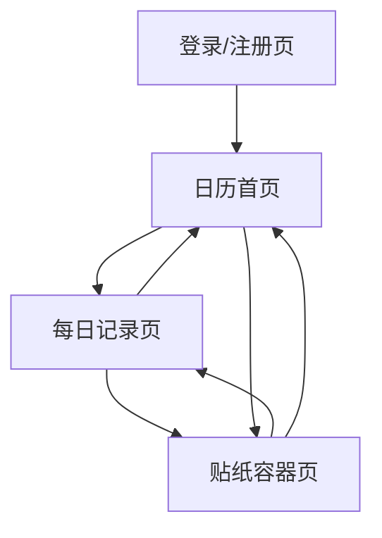

# 饮食记录网页 - 产品需求文档

## 1. 产品概述
一款可爱的饮食记录网页应用，用户可以通过日历视图记录每天的食物内容，并将食物转化为精美的贴纸收集在贴纸容器中。

目标用户：注重饮食健康、喜欢记录生活的年轻用户群体。

## 2. 核心功能

### 2.1 用户角色
| 角色 | 注册方式 | 核心权限 |
|------|----------|----------|
| 普通用户 | 邮箱/手机号注册 | 记录饮食、查看日历、管理贴纸 |

### 2.2 功能模块

饮食记录应用包含以下主要页面：

1. **登录/注册页**：用户认证入口，支持邮箱注册和登录。
2. **日历首页**：展示月度日历视图，可查看和编辑每日饮食记录。
3. **每日记录页**：添加/编辑当天吃的食物内容。
4. **贴纸容器页**：展示收集的所有食物贴纸，支持分类浏览和搜索。

### 2.3 页面详情

| 页面名称 | 模块名称 | 功能描述 |
|----------|----------|----------|
| 登录/注册页 | 登录表单 | 输入邮箱和密码进行登录验证。 |
| 登录/注册页 | 注册表单 | 输入邮箱、密码、昵称完成账号注册。 |
| 登录/注册页 | 第三方登录 | 支持微信/QQ快捷登录（可选）。 |
| 日历首页 | 月度日历 | 展示当前月份的日历网格，每天显示已记录的食物缩略图。 |
| 日历首页 | 月份切换 | 左右箭头切换月份，快速跳转到指定年月。 |
| 日历首页 | 今日快捷入口 | 一键跳转到今天的记录页面。 |
| 日历首页 | 统计卡片 | 展示本月记录天数、收集贴纸数量等统计信息。 |
| 每日记录页 | 日期展示 | 显示当前记录的日期，支持前后日期切换。 |
| 每日记录页 | 食物添加 | 输入食物名称、选择食物类别、上传食物照片。 |
| 每日记录页 | 食物列表 | 展示当天已添加的所有食物条目，支持编辑和删除。 |
| 每日记录页 | 生成贴纸 | 将当天记录的食物一键生成贴纸，存入贴纸容器。 |
| 每日记录页 | 心情标签 | 为当天添加心情标签（开心、一般、难过等）。 |
| 贴纸容器页 | 贴纸网格 | 以网格形式展示所有收集的贴纸，支持按类别筛选。 |
| 贴纸容器页 | 贴纸详情 | 点击贴纸查看大图、食物信息、记录日期。 |
| 贴纸容器页 | 搜索功能 | 按食物名称或类别搜索贴纸。 |
| 贴纸容器页 | 排序功能 | 按时间、类别、名称排序贴纸。 |
| 贴纸容器页 | 贴纸分享 | 生成贴纸卡片图片，支持保存和分享。 |

## 3. 核心流程

### 用户操作流程

1. **新用户注册流程**：访问首页 → 点击注册 → 填写信息 → 完成注册 → 进入日历首页
2. **日常记录流程**：打开日历 → 选择日期 → 添加食物 → 生成贴纸 → 查看贴纸容器
3. **回顾浏览流程**：进入贴纸容器 → 筛选/搜索贴纸 → 查看贴纸详情 → 分享贴纸

### 页面导航流程图

## 4. 用户界面设计

### 4.1 设计风格

- **主色调**：温暖的橙色 (#FF9F43) 作为主题色，搭配米白色 (#FFF9F0) 背景
- **辅助色**：薄荷绿 (#26DE81) 表示健康食物，粉色 (#FF6B9D) 表示甜食，蓝色 (#45AAF2) 表示饮品
- **按钮样式**：圆角胶囊形状，带轻微阴影，hover时有上浮动画效果
- **字体**：主字体使用圆润的无衬线字体（如 Nunito 或 Quicksand），标题 24-32px，正文 14-16px
- **布局风格**：卡片式布局，大量使用圆角（12-24px），留白充足
- **图标风格**：线性图标，2px描边，圆角端点，色彩与主题呼应
- **贴纸风格**：扁平化插画风格，带轻微投影和圆角，边缘有白色描边

### 4.2 页面设计概述

| 页面名称 | 模块名称 | UI元素 |
|----------|----------|--------|
| 登录/注册页 | 整体布局 | 居中卡片，最大宽度400px，圆角24px，柔和阴影，背景使用渐变色（橙到粉的柔和渐变） |
| 登录/注册页 | 输入框 | 圆角12px，浅灰色边框，focus时边框变为主题橙色，带图标前缀 |
| 登录/注册页 | 按钮 | 主题橙色渐变背景，白色文字，圆角24px，全宽，hover时轻微放大 |
| 日历首页 | 日历网格 | 7列网格，单元格圆角12px，当天高亮显示，有记录的日期显示食物缩略图 |
| 日历首页 | 月份导航 | 顶部居中显示年月，左右箭头切换，箭头使用圆形按钮 |
| 日历首页 | 统计卡片 | 横向排列的卡片，圆角16px，浅色背景，显示图标和数字 |
| 每日记录页 | 日期头部 | 大字体显示日期，左右箭头切换日期，下方显示星期 |
| 每日记录页 | 食物输入 | 圆角输入框，带食物类别图标选择器（早餐/午餐/晚餐/加餐） |
| 每日记录页 | 食物列表项 | 卡片式展示，左侧食物图标，中间名称和类别，右侧删除按钮 |
| 每日记录页 | 生成贴纸按钮 | 主题色大按钮，带闪光动画效果，位于页面底部 |
| 贴纸容器页 | 筛选栏 | 横向滚动的类别标签，圆角胶囊，选中时填充主题色 |
| 贴纸容器页 | 贴纸网格 | 瀑布流或等宽网格，贴纸卡片圆角16px，带轻微旋转角度增加趣味性 |
| 贴纸容器页 | 贴纸卡片 | 食物图片或插画，下方显示食物名称和日期，边缘有装饰性边框 |

### 4.3 响应式设计

- **桌面优先**：默认适配桌面端，最大内容宽度1200px
- **移动端适配**：日历在移动端变为单列或双列布局，贴纸网格自适应列数
- **触摸优化**：按钮和可点击区域最小44px，支持手势滑动切换月份

### 4.4 动画效果

- **贴纸生成动画**：点击生成时，食物图标有放大旋转效果，然后飞入贴纸容器
- **页面切换**：使用淡入淡出过渡，时长300ms
- **日历翻页**：月份切换时有滑动动画
- **贴纸悬停**：鼠标悬停时贴纸轻微上浮并放大，阴影加深
