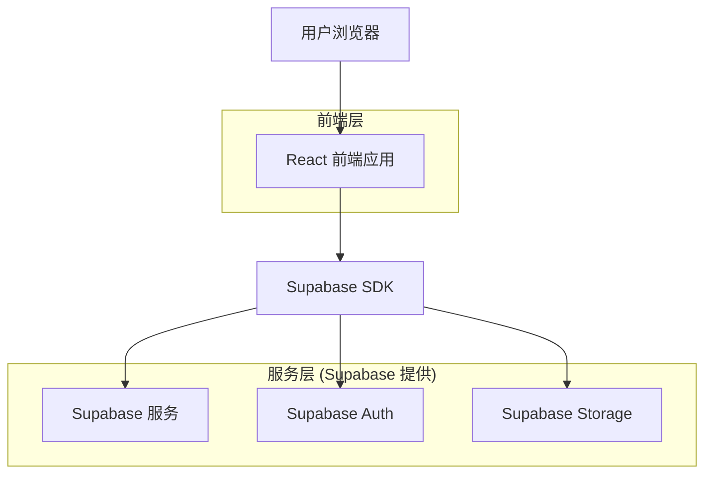
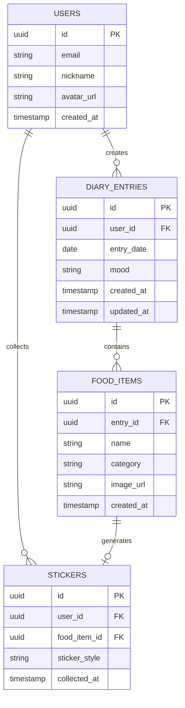

# 饮食记录网页 - 技术架构文档

## 1. 架构设计



## 2. 技术描述

- **前端**: React@18 + TailwindCSS@3 + Vite
- **初始化工具**: vite-init
- **后端**: Supabase (PostgreSQL + Auth + Storage)
- **UI组件库**: shadcn/ui (基于 Radix UI)
- **日期处理**: date-fns
- **状态管理**: React Context + useState/useReducer
- **图标**: Lucide React
- **动画**: Framer Motion

## 3. 路由定义

| 路由 | 用途 |
|------|------|
| /login | 登录页面，用户认证入口 |
| /register | 注册页面，新用户注册 |
| /calendar | 日历首页，展示月度饮食记录 |
| /record/:date | 每日记录页面，添加/编辑指定日期的食物 |
| /stickers | 贴纸容器页面，展示收集的所有贴纸 |
| /profile | 个人中心，用户信息和设置 |

## 4. 数据模型

### 4.1 数据模型定义



### 4.2 数据定义语言

**用户表 (users)**
```sql
-- 创建表
CREATE TABLE users (
    id UUID PRIMARY KEY DEFAULT gen_random_uuid(),
    email VARCHAR(255) UNIQUE NOT NULL,
    nickname VARCHAR(100) NOT NULL,
    avatar_url TEXT,
    created_at TIMESTAMP WITH TIME ZONE DEFAULT NOW()
);

-- 权限设置
GRANT SELECT ON users TO anon;
GRANT ALL PRIVILEGES ON users TO authenticated;
```

**饮食记录表 (diary_entries)**
```sql
-- 创建表
CREATE TABLE diary_entries (
    id UUID PRIMARY KEY DEFAULT gen_random_uuid(),
    user_id UUID NOT NULL REFERENCES users(id) ON DELETE CASCADE,
    entry_date DATE NOT NULL,
    mood VARCHAR(20) CHECK (mood IN ('happy', 'normal', 'sad', 'excited', 'tired')),
    created_at TIMESTAMP WITH TIME ZONE DEFAULT NOW(),
    updated_at TIMESTAMP WITH TIME ZONE DEFAULT NOW(),
    UNIQUE(user_id, entry_date)
);

-- 创建索引
CREATE INDEX idx_diary_entries_user_id ON diary_entries(user_id);
CREATE INDEX idx_diary_entries_date ON diary_entries(entry_date);

-- 权限设置
GRANT SELECT ON diary_entries TO anon;
GRANT ALL PRIVILEGES ON diary_entries TO authenticated;
```

**食物项目表 (food_items)**
```sql
-- 创建表
CREATE TABLE food_items (
    id UUID PRIMARY KEY DEFAULT gen_random_uuid(),
    entry_id UUID NOT NULL REFERENCES diary_entries(id) ON DELETE CASCADE,
    name VARCHAR(200) NOT NULL,
    category VARCHAR(50) CHECK (category IN ('breakfast', 'lunch', 'dinner', 'snack', 'drink')),
    image_url TEXT,
    created_at TIMESTAMP WITH TIME ZONE DEFAULT NOW()
);

-- 创建索引
CREATE INDEX idx_food_items_entry_id ON food_items(entry_id);

-- 权限设置
GRANT SELECT ON food_items TO anon;
GRANT ALL PRIVILEGES ON food_items TO authenticated;
```

**贴纸表 (stickers)**
```sql
-- 创建表
CREATE TABLE stickers (
    id UUID PRIMARY KEY DEFAULT gen_random_uuid(),
    user_id UUID NOT NULL REFERENCES users(id) ON DELETE CASCADE,
    food_item_id UUID REFERENCES food_items(id) ON DELETE SET NULL,
    food_name VARCHAR(200) NOT NULL,
    food_category VARCHAR(50),
    sticker_style VARCHAR(50) DEFAULT 'default',
    source_date DATE,
    collected_at TIMESTAMP WITH TIME ZONE DEFAULT NOW()
);

-- 创建索引
CREATE INDEX idx_stickers_user_id ON stickers(user_id);
CREATE INDEX idx_stickers_category ON stickers(food_category);

-- 权限设置
GRANT SELECT ON stickers TO anon;
GRANT ALL PRIVILEGES ON stickers TO authenticated;
```

## 5. 组件设计

### 5.1 核心组件列表

| 组件名称 | 用途 | 位置 |
|----------|------|------|
| CalendarGrid | 月度日历网格展示 | components/Calendar/CalendarGrid.tsx |
| CalendarDay | 单个日期单元格 | components/Calendar/CalendarDay.tsx |
| FoodInput | 食物添加输入框 | components/Food/FoodInput.tsx |
| FoodList | 食物列表展示 | components/Food/FoodList.tsx |
| FoodItem | 单个食物条目 | components/Food/FoodItem.tsx |
| StickerCard | 贴纸卡片展示 | components/Sticker/StickerCard.tsx |
| StickerGrid | 贴纸网格容器 | components/Sticker/StickerGrid.tsx |
| StickerFilter | 贴纸筛选栏 | components/Sticker/StickerFilter.tsx |
| MoodSelector | 心情选择器 | components/Common/MoodSelector.tsx |
| CategoryTag | 食物类别标签 | components/Common/CategoryTag.tsx |
| GenerateButton | 生成贴纸按钮 | components/Common/GenerateButton.tsx |

### 5.2 自定义 Hooks

| Hook 名称 | 用途 |
|-----------|------|
| useAuth | 用户认证状态管理 |
| useDiaryEntries | 饮食记录数据操作 |
| useFoodItems | 食物项目数据操作 |
| useStickers | 贴纸数据操作 |
| useCalendar | 日历状态管理 |

## 6. 项目结构

```
src/
├── components/           # 组件目录
│   ├── Calendar/        # 日历相关组件
│   ├── Food/            # 食物相关组件
│   ├── Sticker/         # 贴纸相关组件
│   ├── Common/          # 通用组件
│   └── Layout/          # 布局组件
├── hooks/               # 自定义 Hooks
├── contexts/            # React Context
├── lib/                 # 工具函数
│   ├── supabase.ts      # Supabase 客户端配置
│   └── utils.ts         # 通用工具函数
├── pages/               # 页面组件
│   ├── Login.tsx
│   ├── Register.tsx
│   ├── Calendar.tsx
│   ├── Record.tsx
│   ├── Stickers.tsx
│   └── Profile.tsx
├── types/               # TypeScript 类型定义
├── styles/              # 全局样式
└── App.tsx              # 应用入口
```

## 7. 关键技术决策

### 7.1 为什么选择 Supabase？
- 内置用户认证系统，支持邮箱/社交登录
- PostgreSQL 数据库，支持复杂查询和关系
- 对象存储支持食物图片上传
- 实时订阅功能，可实现数据同步
- 免费额度充足，适合个人项目

### 7.2 贴纸生成逻辑
- 贴纸不存储实际图片文件，而是根据食物信息动态生成样式
- 使用 CSS 和 SVG 创建贴纸视觉效果
- 贴纸样式根据食物类别自动选择配色方案
- 支持导出为图片（使用 html2canvas 或类似库）

### 7.3 数据缓存策略
- 使用 React Query 或 SWR 进行服务端状态管理
- 本地缓存日历数据和贴纸数据
- 乐观更新 UI，提升用户体验
